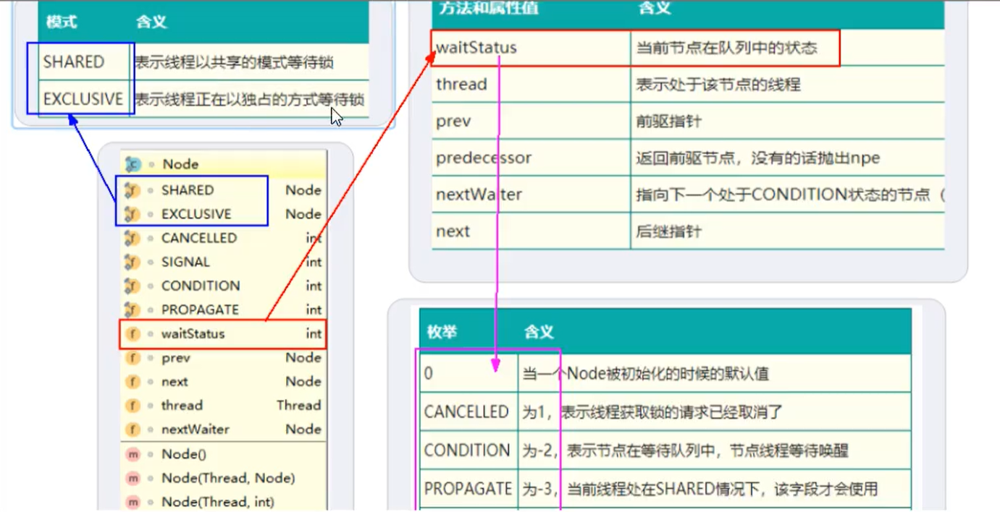
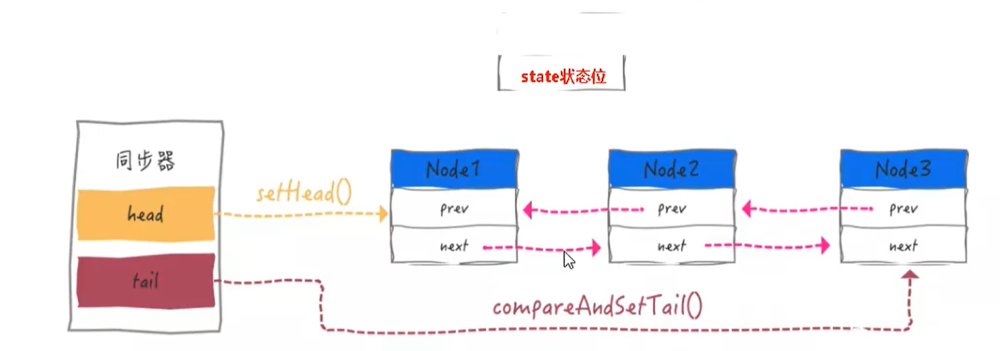

## AQS内部体系架构


##### AQS的int变量

AQS的同步状态State成员变量


银行办理业务的受理窗口状态

- 零就是没有人，自由状态可以办理
- 大于等于1，有人占用窗口，就去等

#### AQS的CLH队列

CLH队列（三个大牛的名字），成为一个双向列表


##### 小总结：

有阻塞就需要排队，实现排队必然需要队列；state变量+CLH变种的双端队列


#### 内部类Node(Node类在AQS类的内部)

Node的int变量，Node的等待状态waitState成员变量 --> volatile int waitStatus，**与AQS中的同步状态state成员变量命名不太一样哦** ;

讲直白点，等候区其他顾客（其他线程）的等待状态，队列中每个队列的个体就是一个Node


#### Node类的讲解

内部结构 

```java
static final class Node {

    // 共享
    static final Node SHARED = new Node();

    // 独占
    static final Node EXCLUSIVE = null;

    // 线程被取消了
    static final int CANCELLED =  1;

    // 后继线程需要被唤醒
    static final int SIGNAL    = -1;

    // 等待condition 唤醒
    static final int CONDITION = -2;

    // 共享式同步状态获取将会无条件地传播下去
    static final int PROPAGATE = -3;

    // 初始值为0，状态为上面的几种
    volatile int waitStatus;

    // 前置结点
    volatile Node prev;

    // 后继结点
    volatile Node next;

    volatile Thread thread;

    Node nextWaiter;
    ...
```

属性说明




#### AQS 同步队列的基本结构




