## 从ReentrantLock开始解读AQS

Lock接口的实现类，基本都是通过【聚合】了一个【队列同步器】的子类完成线程访问控制的

#### ReentrantLock的原理

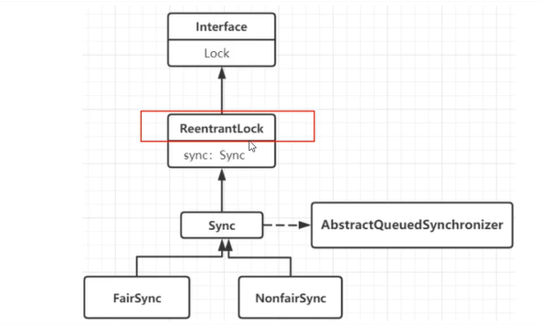

#### 从最简单的lock方法开始看看公平和非公平

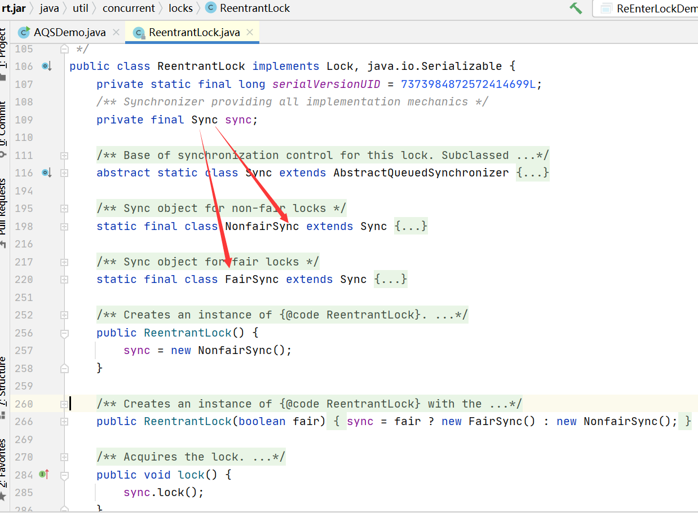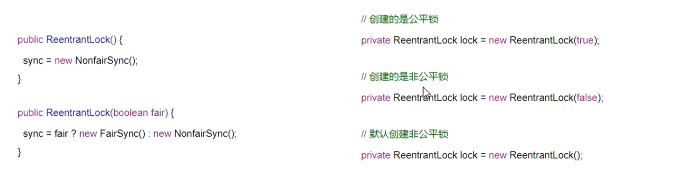

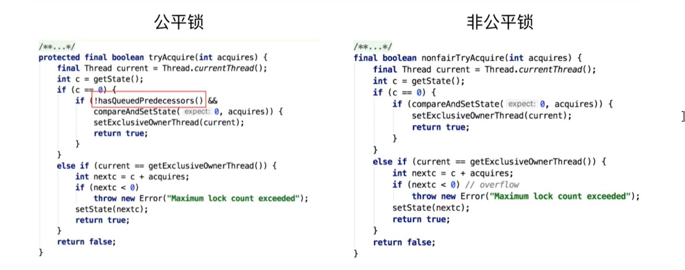

**可以明显看出公平锁和非公平锁的lock()方法唯一的区别就在于公平锁在获取同步状态时多了一个限制条件：hasQueuedPredecessors()，hasQueuePredecessors是公平锁加锁时判断等待队列中是否存在有效结点的方法。**


#### 非公平锁走起，方法lock()

对比公平锁和非公平锁tryAcquire()方法的实现代码，其实差别就在于非公平锁获取锁时比公平锁少了一个判断!hasQueuedPredecessors()。

hasQueuedPredecessors()中判断了是否需要排队，导致了公平锁和非公平锁的差异如下：

**公平锁：**公平锁讲究先到先得，线程在获取锁时，如果这个锁的等待队列中已经有线程在等待，那么当前线程就会进入到等待队列中；

**非公平锁：**不管是否有等待队列，如果可以获取锁，则立即占有锁对象，也就是说队列的第一个线程在unpark()，之后还是需要竞争锁（存在线程竞争的情况下）


##### AQS源码深度分析

**lock()方法**

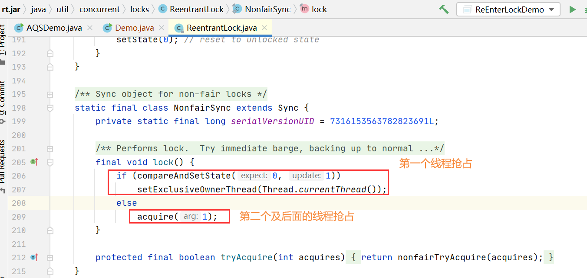

代码解读

```
在第一个线程进来加锁的时候，由于Node结点默认的状态是0，所以第一个线程会走if判断，通过底层CAS改变自身状态码为1，将当前线程设置为自己。当第二个线程进来的时候，获取到的状态state为1，if条件自旋不成立，进入else条件，调用acquire()方法。
```

**acquire()方法**

源码和3大流程走向

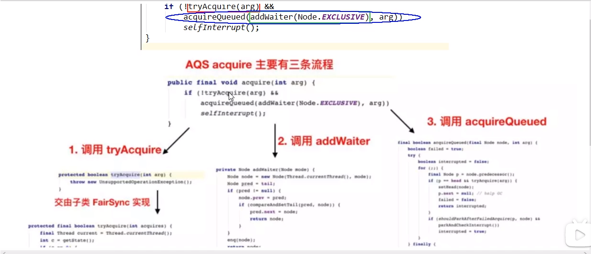

**tryAcquire(arg)方法**

演示非公平锁

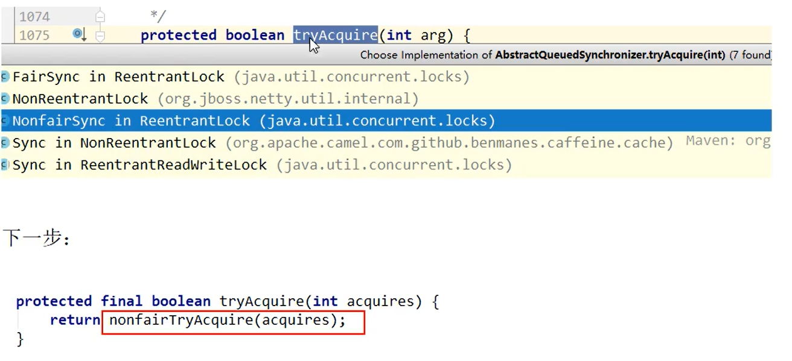

.jpg)

代码解读

```
第二个线程进来后，首先执行绿框代码，发现当前执行的线程状态为1，红框代码不成立；current获取的是当前进来执行的线程，也就是第二个线程（也许会是第一个线程，因为会有可重入锁），getExclusiveOwnerThread()方法获取到的是正在受理的线程，也就是第一个线程，他们不相等，所以也不成立；最后直接返回一个false。
那么红框代码是什么意思呢？就是当第二个线程进来的时候，第一个线程刚好处理完，并且把状态state修改为0，那么第二个线程刚好可以抢占线程，并且把自己设置为正在受理的线程，返回true，外层方法结束，类似于双端检测机制。
蓝框代码什么意思呢？就是第一个线程刚刚将业务受理完成，准备解锁，然后又坐下继续办理业务，所以此时的current还是第一个线程，当前getExclusiveOwnerThread()方法获取到的是也是正在受理的线程，即第一个线程，所以进入else if 判断框，此时nextc = 1+1，设置状态为2，返回true，外层方法结束，此种情况是可重入锁会进入这个判断代码。
```

如果 return false ，则继续推进条件，走下一个方法addWaiter；如果return true，外层的acquire(int aeg)方法就直接结束。

**addWaiter(Node.EXCLUSIVE)方法**

方法.jpg)

代码解读：

```
当线程第一次进来addWaiter()方法时，tail还没有完成初始化，所以pred也是null，if条件不成立，直接调用下面的enq方法（所以先看enq方法解读），当后面线程再次进入addWaiter方法时，tail已经初始化完成，不需要调用enq方法，直接走if条件，让线程入队。
```

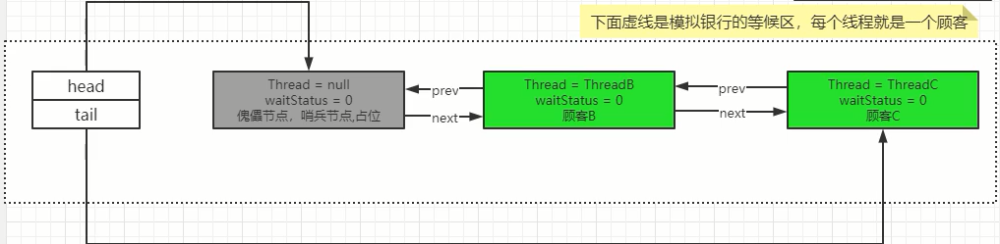

enq(node)方法

方法.jpg)

代码解读

```
enq(node)方法是一个自旋锁方法，第二个线程进入tryAcquire() -> addWaiter() -> enq();第一次进来tail结点为null，需要初始化，创建一个新节点，并且将head指向它，然后将head指向tail，其实创建的新节点就是一个哨兵(傀儡)节点（如下图一）。继续自旋，此时的tail结点已经初始化完成，不在为null，所以走else分支，真是将此时的第二个线程结点加入队列（如下图二）。
```

创建哨兵节点.jpg)

创建队列节点.jpg)

双向链表中，第一个节点为虚节点(也叫哨兵节点，傀儡结点)，其实并不存储任何信息，只是占位。真正的第一个有数据的结点，是从第二个结点开始的 。

假如下一个Thread线程进来，将会进行：

- prev
- compareAndSetTail
- next

#### acquireQueued(addWaiter(Node.EXCLUSIVE),arg)

acquireQueued（让线程入队，然后等待LockSupport进行park阻塞操作，执行到这一步才算是真正的入队成功了）

方法.jpg)

代码解读：

```
acquireQueued方法也是一个自旋方法；final Node p = node.predecessor();当线程第一次执行到acquireQueued方法时，p是获取到的当前线程的前一个结点（在本文最后有此方法代码），获取到是一个傀儡结点，在if条件中，p确实指向head，然后在执行tryAcquire方法，如果返回false，则进入下面的判断。
在shouldParkAfterFailedAcquire方法中，我们会将哨兵结点的的状态state由0变为-1,然后返回false让acquireQueued方法继续自旋，再次调用在shouldParkAfterFailedAcquire方法时返回true；然后在调用parkAndCheckInterrupt方法，此时才真正的将当前线程入队阻塞。
```

```java
private static boolean shouldParkAfterFailedAcquire(Node pred, Node node) {
    int ws = pred.waitStatus;
    if (ws == Node.SIGNAL)
        return true;
    if (ws > 0) {
        do {
            node.prev = pred = pred.prev;
        } while (pred.waitStatus > 0);
        pred.next = node;
    } else {
        compareAndSetWaitStatus(pred, ws, Node.SIGNAL);
    }
    return false;
}

private final boolean parkAndCheckInterrupt() {
    LockSupport.park(this);
    return Thread.interrupted();
}
```

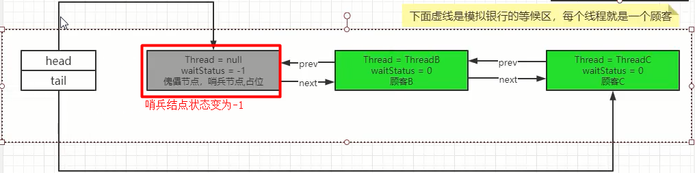


如果抢占失败，就进入到蓝色框框

shouldParkAfterFailedAcquire 和 parkAndCheckInterrupt方法中 

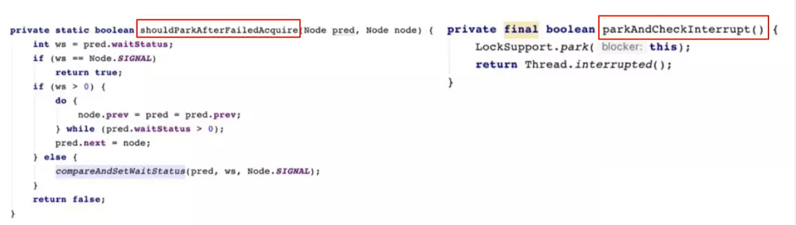

shouldParkAfterFailedAcquire 方法

.jpg)

.jpg)

如果前驱结点的waitStatus是SIGNAL状态，即shouldParkAfterFailedAcquire方法会返回true程序会继续向下执行 parkAndCheckInterrupt 方法，用于将当前线程挂起

parkAndCheckInterrupt方法

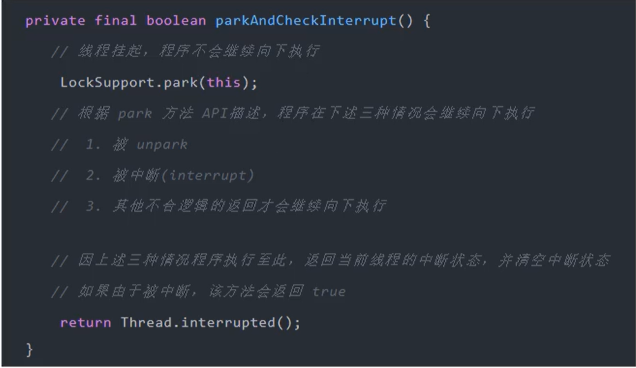

#### 方法unlock()

sync.release(1)  -> tryRelease(arg) -> unparkSuccessor

```java
// 线程调用unlock方法释放锁
public void unlock() {
    sync.release(1);
}

public final boolean release(int arg) {
    if (tryRelease(arg)) {
        // h 是队列中的哨兵节点
        Node h = head;
        if (h != null && h.waitStatus != 0)
            // 释放队列中的第一个线程
            unparkSuccessor(h);
        return true;
    }
    return false;
}

// 将当前业务线程设置为null，并且将当前业务线程设置为0；
protected final boolean tryRelease(int releases) {
    int c = getState() - releases;
    // 判断当前释放锁线程与在执行业务的线程是否是同一个
    if (Thread.currentThread() != getExclusiveOwnerThread())
        throw new IllegalMonitorStateException();
    boolean free = false;
    if (c == 0) {
        free = true;
        // 将当前业务线程设置为null
        setExclusiveOwnerThread(null);
    }
    setState(c);
    return free;
} 

private void unparkSuccessor(Node node) {
    // 当前哨兵节点的状态为-1 
    int ws = node.waitStatus;
    if (ws < 0)
        // 设置哨兵节点状态为0
        compareAndSetWaitStatus(node, ws, 0);
    // s 为队列中的第一个有效线程
    Node s = node.next;
    if (s == null || s.waitStatus > 0) {
        s = null;
        for (Node t = tail; t != null && t != node; t = t.prev)
            if (t.waitStatus <= 0)
                s = t;
    }
    // 解锁队列中第一个有效结点
    if (s != null)
        LockSupport.unpark(s.thread);
}
```

```java
// 入队之后，线程都被阻塞在了 acquireQueued方法里面的 parkAndCheckInterrupt 方法中,一旦线程队列里面线程被解锁，马上返回Thread.interrupted();--》true；然后在通过acquireQueued方法接着自旋;参数node就是当前队列里面的第一个线程，获取到p就是当前线程的前一个结点头结点，调用 tryAcquire 方法成功后，设置队列里面的第一个线程状态为-1，设置正在处理的业务线程为当前队列的第一个线程，然后返回true，进入if条件，重新设置头结点为队列里面第一个线程，然后将其变成哨兵(傀儡)结点，之前的哨兵节点被GC回收；

// 当然这是理想的状态，有可能队列中第一个线程解锁之后，一个新准备入队的线程刚好加锁执行lock()方法，比刚刚解锁的线程快一步，那么刚刚解锁的线程自旋 acquireQueued 方法的 tryAcquire 方法，发现又匹配不上，那么刚刚解锁的线程又会被加锁。这里就体现了锁的非公平性。
final void lock() {
    if (compareAndSetState(0, 1))
        setExclusiveOwnerThread(Thread.currentThread());
    else
        acquire(1);
}
------------------------------------------------------
private final boolean parkAndCheckInterrupt() {
    LockSupport.park(this);
    return Thread.interrupted();
}

final Node predecessor() throws NullPointerException {
    Node p = prev;
    if (p == null)
        throw new NullPointerException();
    else
        return p;
}

final boolean acquireQueued(final Node node, int arg) {
    boolean failed = true;
    try {
        boolean interrupted = false;
        for (;;) {
            final Node p = node.predecessor();
            if (p == head && tryAcquire(arg)) {
                setHead(node);
                p.next = null; // help GC
                failed = false;
                return interrupted;
            }
            if (shouldParkAfterFailedAcquire(p, node) &&
                parkAndCheckInterrupt())
                interrupted = true;
        }
    } finally {
        if (failed)
            cancelAcquire(node);
    }
}

private void setHead(Node node) {
    head = node;
    node.thread = null;
    node.prev = null;
}
```

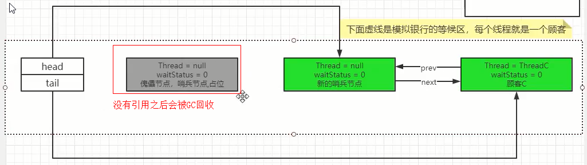

杀回马枪

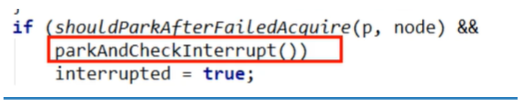

