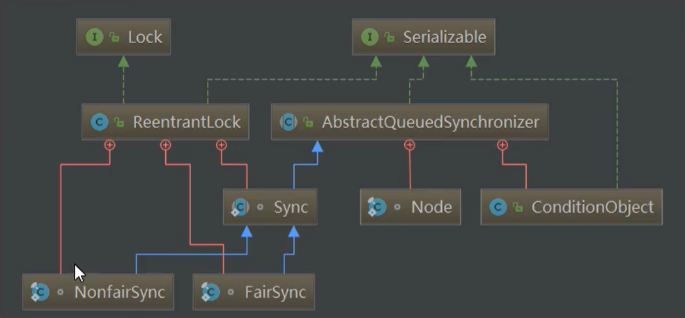
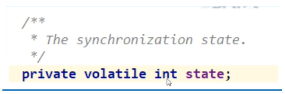
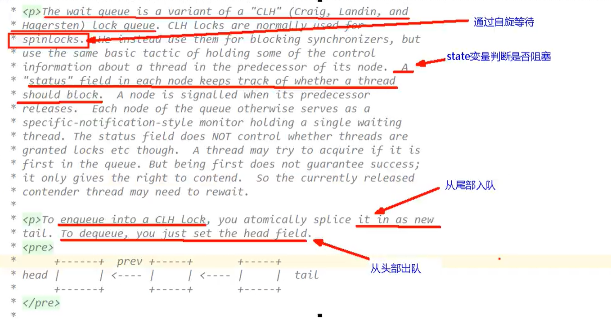

## AQS内部体系架构

##### AQS的int变量

AQS的同步状态State成员变量

银行办理业务的受理窗口状态

- 零就是没有人，自由状态可以办理
- 大于等于1，有人占用窗口，就去等

#### AQS的CLH队列

CLH队列（三个大牛的名字），成为一个双向列表

##### 小总结：

有阻塞就需要排队，实现排队必然需要队列；state变量+CLH变种的双端队列

#### 内部类Node(Node类在AQS类的内部)

Node的int变量，Node的等待状态waitState成员变量，volatile int waitStatus；

讲直白点，等候区其他顾客（其他线程）的等待状态，队列中每个队列的个体就是一个Node

