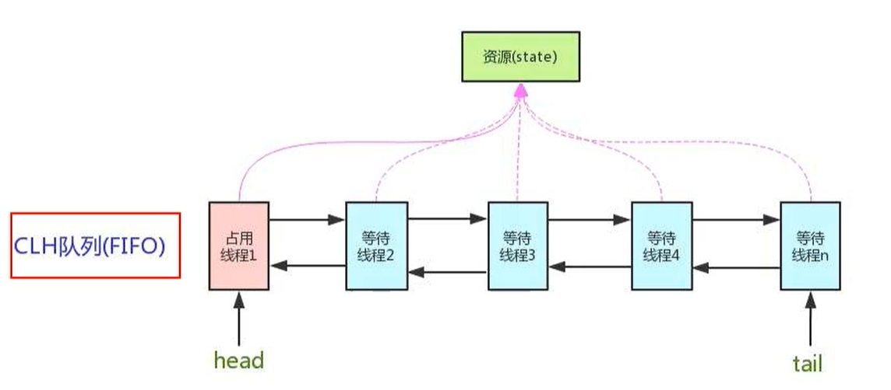

## AbstractQueueSynchronize之AQS

#### 前置知识

- 公平锁和非公平锁
- 可重入锁
- LockSupport
- 自旋锁
- 数据结构之链表
- 设计模式之模板设计模式

#### AQS是什么

字面意思 抽象队列同步器(AbstractQueueSynchronize)

源代码

·

AbstractOwnableSynchronizer
AbstractQueuedLongSynchronizer
AbstractQueuedSynchronizer

**通常地：AbstractQueuedSynchronizer简称为AQS**

技术解释

是用来构建锁或者其他同步器组件的**重量级框架及整个JUC体系的基石**，通过内置的FIFO**队列**来完成资源获取线程的队列工作，并通过一个**int类型变量**表示持有锁的状态。

#### AQS为什么是JUC内容中最重要的基石

和AQS有关的

- **ReentrantLock**

- **CountDownLatch**

- **ReentrantReadWriteLock**

- **Semaphore**

。。。

进一步理解锁和同步器的关系

锁，面向锁的**使用者**，定义了程序员和锁交互的使用层API，隐藏了实现细节，你调用即可。

同步器，面向锁的**实现者**，比如Java并发大神DougLee，提出统一规范并简化了锁的实现，屏蔽了同步状态管理、阻塞线程排队和通知、唤醒机制等。

#### 能干嘛

加锁会导致阻塞，有阻塞就需要排队等待，实现排队等待必然需要某种形式的队列来进行管理。

| 解释说明                                                     |
| ------------------------------------------------------------ |
| 抢到资源的线程直接使用处理业务逻辑，抢不到资源的必然涉及一种**排队等候机制**。抢占资源失败的线程继续去等待（类似银行业务办理窗口都满了，暂时没有受理窗口，**顾客只能去候客区等待**），但等候线程仍然保留获取锁的可能且获取锁流程仍在继续。  既然说到了**排队等候机制**，那么就一定会有某种队列形成，这样的队列是什么数据结构呢？  如果共享资源被占用，**就需要一定的阻塞等待唤醒机制来保证锁分配**。这个机制主要用的是CLH队列的变体实现的，将暂时获取不到的线程加入到队列中，这个队列就是AQS的抽象表现。它将请求共享资源的线程封装成队列的结点（**Node**），通过CAS、自旋以及LockSupport.park()的方式，维护**state**变量的状态，使并发达到同步的控制效果。 |

