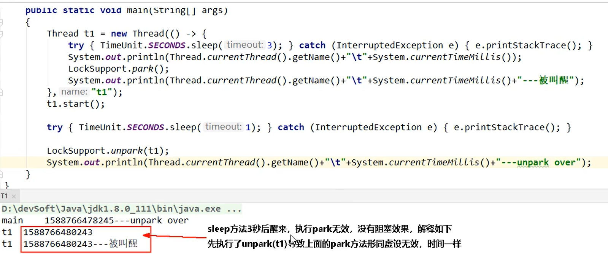

## LockSupport

网页API学习网址：https://www.apiref.com/java11-zh/java.base/module-summary.html

用于创建锁和其他同步类的基本线程阻塞原语。


LockSupport在哪看？

https://www.apiref.com/java11-zh/java.base/java/util/concurrent/locks/package-summary.html

.jpg)·

是什么？（https://www.apiref.com/java11-zh/java.base/java/util/concurrent/locks/LockSupport.html）


**用于创建锁和其他同步类的基本线程阻塞原语。**

LockSupport中的park()和unpark()的作用分别是阻塞线程和解除阻塞线程


## 线程等待唤醒机制(wait/notify)

##### 传统的线程等待和唤醒的方法


##### 3种让线程等待和唤醒的方法

1. 方式1：使用Object中的wait()方法让线程等待，使用Object中的Notify()方法唤醒线程

2. 方式2：使用JUC包中Condition的await()方法让线程等待，使用signal()方法唤醒线程

3. 方式3：LockSupport类可以阻塞当前线程以及唤醒指定被阻塞的线程

   

####线程等待唤醒机制(wait/notify)

**Object类中的wait和notify方法实现线程等待和唤醒**

```java
static Object objectLock = new Object();
public static void synchronizedWaitNotify(){
    new Thread(() -> {
        synchronized (objectLock) {
            System.out.println(Thread.currentThread().getName() + "\t" + "come in");
            try {
                // wait需要和synchronized一起使用
                objectLock.wait();
            } catch (InterruptedException e) {
                e.printStackTrace();
            }
        }
        System.out.println(Thread.currentThread().getName() + "\t" + "被唤醒");
    }, "A").start();

    new Thread(() -> {
        synchronized (objectLock){
            System.out.println(Thread.currentThread().getName() + "\t" + "通知");
            objectLock.notify();
        }
    }, "B").start();
}
```

异常1：wait方法和notify方法，两个都去掉同步代码块

```java
异常情况：
Exception in thread "A" Exception in thread "B" java.lang.IllegalMonitorStateException
```

异常2：将notify放在wait方法前面

程序无法执行，无法唤醒

**小总结：** wait和notify方法必须要在同步块或者方法里面成对出现使用；先wait后notify才OK，颠倒顺序后无法解锁。

**Condition接口中的await和signal方法实现线程的等待和唤醒**

```java
static Lock lock = new ReentrantLock();
static Condition condition = lock.newCondition();
 
public static void synchronizedAwaitSignal(){
    new Thread(() -> {
        lock.lock();
        System.out.println(Thread.currentThread().getName() + "\t" + "-----come in");
        try {
            try {
                // await需要和lock一起使用
                condition.await();
            } catch (InterruptedException e) {
                e.printStackTrace();
            }
            System.out.println(Thread.currentThread().getName() + "\t" + "-----被唤醒");
        } finally {
            lock.unlock();
        }
    }, "A").start();

    new Thread(() -> {
        lock.lock();
        try {
            condition.signal();
            System.out.println(Thread.currentThread().getName() + "\t" + "-----通知");
        } finally {
            lock.unlock();
        }
    }, "B").start();

}
```

异常1：await和signal方法，两个都去掉lock.lock()和 lock.unlock();

```java
异常情况
Exception in thread "A" Exception in thread "B" java.lang.IllegalMonitorStateException
```

异常2：将await休眠一秒，让signal方法先执行

 程序无法执行，无法唤醒


#### 传统的synchronized和Lock实现等待唤醒通知的约束

线程先要获得并持有锁，必须在锁块（Synchronized或lock）中；必须要等


### LockSupport类中的park等待和unpark唤醒

是什么？

通过park()和unpark()方法来实现阻塞和唤醒线程的操作


##### 主要方法：

**API：**


**阻塞：**

park()/park(Object blocker)


permit默认是0，所以一开始调用park()方法，当前线程就会阻塞，直到别的线程将当前线程的permit设置为1时，park方法会被唤醒，然后会将permit再次设置为0并返回。

阻塞当前线程/阻塞传入的具体线程

**唤醒：**

unpark(Thread thread)


调用unpark(thread)方法后，就会将thread线程的许可permit设置为1（注意多次调用unpark方法，不会累加，permit还是1），会自动唤醒thread线程，即之前阻塞中的LockSupport()方法会立即返回。

**LockSupport 代码无锁块要求**

```java
// a  -----come in
// b  -----b 发出唤醒通知了
// a  -----被唤醒
public static void lockSupportParkUnpark(){
        Thread a = new Thread(() -> {
//            try { TimeUnit.SECONDS.sleep(2); } catch (InterruptedException e) { e.printStackTrace(); }
            System.out.println(Thread.currentThread().getName() + "\t" + "-----come in");
            LockSupport.park(); // 被阻塞，等待通知，等待放行
            System.out.println(Thread.currentThread().getName() + "\t" + "-----被唤醒");
        }, "a");
        a.start();

        try { TimeUnit.SECONDS.sleep(1); } catch (InterruptedException e) { e.printStackTrace(); }

        Thread b = new Thread(() -> {
            LockSupport.unpark(a); // 放行
            System.out.println(Thread.currentThread().getName() + "\t" + "-----b 发出唤醒通知了");
        }, "b");
        b.start();
    }
```

不仅如此，LockSupport还支持之前错误的先唤醒后等待

```java
// b  -----b 发出唤醒通知了
// a  -----come in
// a  -----被唤醒
public static void lockSupportParkUnpark(){
    Thread a = new Thread(() -> {
        try { TimeUnit.SECONDS.sleep(2); } catch (InterruptedException e) { e.printStackTrace(); }
        System.out.println(Thread.currentThread().getName() + "\t" + "-----come in");
        LockSupport.park(); // 被阻塞，等待通知，等待放行
        System.out.println(Thread.currentThread().getName() + "\t" + "-----被唤醒");
    }, "a");
    a.start();

    try { TimeUnit.SECONDS.sleep(1); } catch (InterruptedException e) { e.printStackTrace(); }

    Thread b = new Thread(() -> {
        LockSupport.unpark(a); // 放行
        System.out.println(Thread.currentThread().getName() + "\t" + "-----b 发出唤醒通知了");
    }, "b");
    b.start();
}
```



### 重要说明

**LockSupport是用来创建锁和其他同步类的基本线程阻塞原语**。

LockSupport是一个线程阻塞类工具类，所有的方法都是静态方法，可以让线程在任意位置阻塞，阻塞之后也有对应的唤醒方法。归根结底，LockSupport调用的unsafe中的native代码。

**LockSupport提供park()和unpark()方法实现阻塞线程和解除阻塞线程的过程。**

LockSupport和每个使用它的线程都有一个许可（permit）关联。permit相当于1,0的开关，默认是0，调用一次unpark()就加1变成1，调用一次park()会消费permit，也就是将1变成0，同时park立即返回。

如果再次调用park会变成阻塞（因为permit为零了会阻塞在这里，一直到permit变为1），这时调用unpark会把permit置为1。

每个线程都有一个相关的permit，permit最多只有一个，重复调用unpark也不会积累凭证。

**形象的理解**
线程阻塞需要消耗凭证(permit)，这个凭证最多只有1个。 
**当调用park方法时 **
如果有凭证，则会直接消耗掉这个凭证然后正常退出；
如果无凭证，就必须阻塞等待凭证可用；
而unpark则相反，它会增加一个凭证，但是凭证最多只能有1个，累加无效。


#### 面试题

**为什么可用先唤醒线程后阻塞线程**？

因为unpark获得一个凭证，之后在调用park方法，就可以名正言顺的凭证消费，故不会阻塞。

**为什么唤醒两次后阻塞两次，但最终结果还是会阻塞线程？**

因为凭证的数量最多是1，连续调用两次unpark和调用一次unpark的效果是一样的，他们都只会增加一个凭证；而调用两次park却需要消费两个凭证，凭证不够，不能放行。

