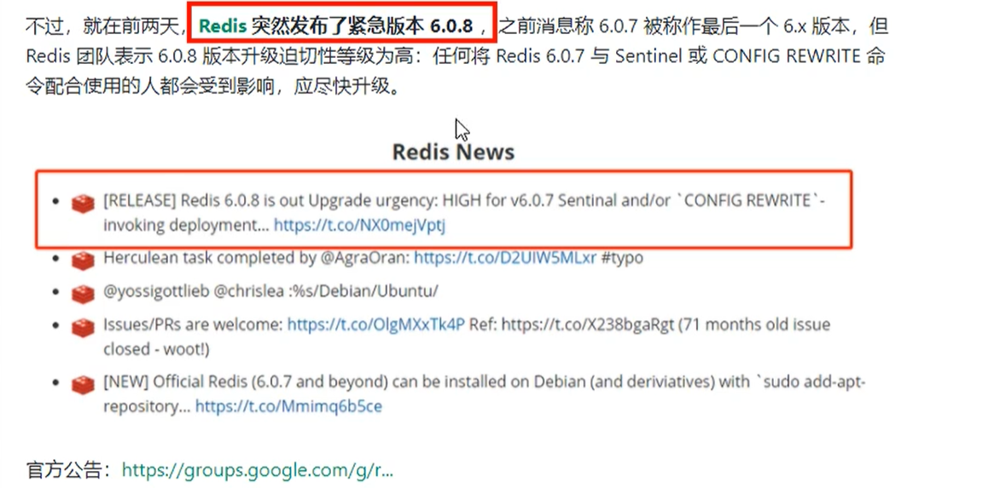
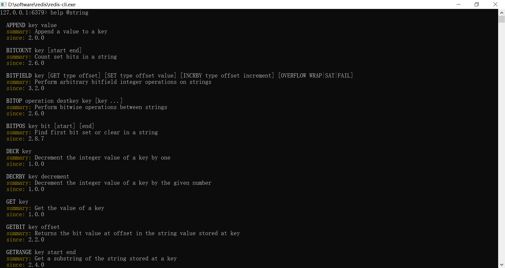
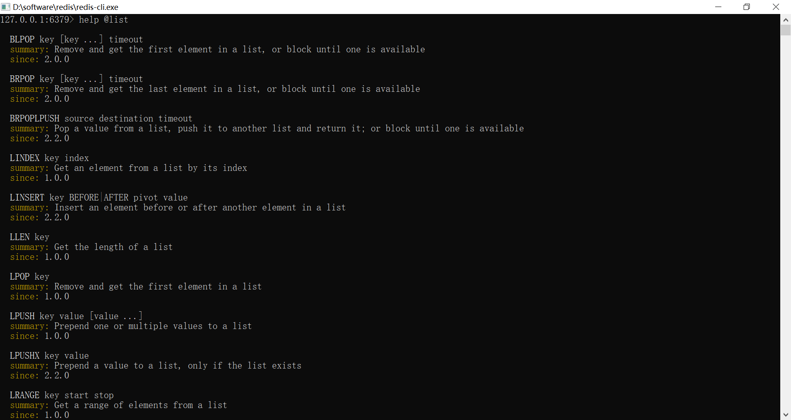
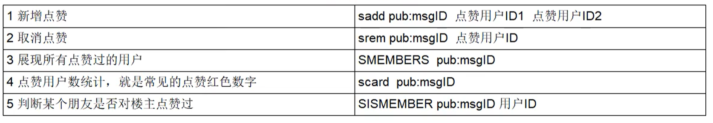

#### 安装redis6.0.8版本

官网地址：https://redis.io/

中文官网地址：http://redis.cn/

安全Bug按照官网提示，升级成为6.0.8



#### 官网命令大全网址(http://redis.cn/commands.html)

##### 8大类型

1. String(字符类型)
2. Hash(散列类型)
3. List(列表类型)
4. Set(集合类型)
5. SortedSet(有序集合类型，简称zset)
6. Bitmap(位图)
7. HyperLogLog(统计)
8. GEO(地理)

**备注：redis 命令是不区分大小写的 ，而key是区分大小写的**

```redis
set m1 n
set M1 N
是不一样的key值，因为redis区分大小写
```

不知道某个类型的使用方法时，我们可以使用redis的**help @方法**，不需要网络就可以查看此类型的使用方法





#### String

- 最常用：set key value / get key

- 同时设置/获取多个键值

  ```
  mset key value [key value ...]
  mget key [key]
  ```

- 数值递增

  ```
  递增数值
  INCR key
  增加指定的整数
  INCRBY key increment
  递减数值
  DECR key
  减少指定的整数
  DECRBY key decrement
  ```

- 截取字符串长度

  ```
  STRLEN key
  ```

- 分布式锁

  ```
  set key value [EX seconds] [PX millseconds] [NX|XX]
  EX:key在多少秒之后过期
  PX:key在多少毫秒之后过去
  NX:当key不存在的时候，才创建key，效果等同于setnx
  XX:当key存在的时候，覆盖key
  
  setnx key value
  ```
  
- 应用场景

  1. 商品编号、订单号采用INCR命令生成
  2. 是否喜欢的文章

#### hash

Map<String, Map<Object,Object>>

- 一次设置一个字段

  ```
  HSET key field value
  ```

- 一次获取一个字段值

  ```
  HGET key field
  ```

- 一次设置多个字段值

  ```
  HMSET key field value [field value]
  HMSET person score 98 birth 20210407
  ```

- 一次获取多个字段值

  ```
  HMGET key field [field...]
  HMGET person score birth
  ```

- 获取所有字段值

  ```
  HGETALL key
  HGETALL person
  ```

- 获取某个key内的全部数量

  ```
  hlen
  ```

- 删除一个key

  ```
  hdel
  ```

#### list 

- 向列表左边添加元素

  ```
  LPUSH key value [value ...]
  ```

- 向列表右边添加元素

  ```
  RPUSH key value [value ...]
  ```

- 查看列表

  ```
  LRANGE key [start(开始下标) stop(结束下标)]
  查看全部数据 LRANGE key 0 -1
  ```

- 获取列表中元素的个数

  ```
  LLEN key
  ```

- 应用场景

  ```
  微信文章订阅公众号
  ```

#### set

- 添加元素

  ```
  SADD key member [member ...]
  ```

- 删除元素

  ```
  SREM key member [member ...]
  ```

- 获取集合中的所有元素

  ```
  SMEMBERS key
  ```

- 判断元素是否在集合中

  ```
  SISMEMBER key member
  ```

- 获取集合中的元素个数

  ```
  SCARD key
  ```

- 从集合中随机弹出n个元素，元素不删除

  ```
  SRANDMEMBER key [数字n]
  ```

- 从集合中随机弹出n个元素，出一个删除一个

  ```
  SPOP key [数字n]
  ```

- 集合运算

  1. 集合的差集运算 A-B

     ```
     属于 A 但不属于 B 的元素构成的集合
     SDIFF key [key ...]
     ```

  2. 集合的交集运算 A∩B

     ```
     属于 A 同时也属于 B 的共同拥有的元素
     SINTER key [key ...]
     ```

  3. 集合的并集运算A∪B

     ```
     属于 A 或者 B 的元素合并后的集合
     SUNION key [key ...]
     ```

- 应用场景

  微信抽奖小程序

  ```
  SRANDMEMBER key 1 --> 随机抽取一个人中奖
   
  SPOP key 2 --> 随机弹出两个人中奖，并且清除这两个人
  ```

  微信朋友圈点赞

  

#### zset

- 向有序集合中加入一个元素和该元素的分数


- 添加元素

  ```
  ZADD key score member [score member ...]
  ```

- 按照元素分数从小到大的顺序返回索引从start到stop之间的元素

  ```
  ZRANGE key start stop [WITHSCORES]
  ```

- 获取元素的分数

  ```
  ZSCORE key member
  ```

- 删除元素

  ```
  ZREM key member [member ...]
  ```

- 获取指定分数范围的元素

  ```
  ZRANGBYSCORE key min max [WITHSCORES][LIMIT offset count]
  ```

- 增加某个元素的分数

  ```
  ZINCRBY key increment member
  ```

- 获取集合中元素的数量

  ```
  ZCARD key
  ```

- 获取指定分数范围内的元素个数

  ```
  ZCOUNT key min max
  ```

- 获取元素的排名

  ```
  从小到大
  ZRANK key member
  从大到小
  ZREVRANK key member
  ```


