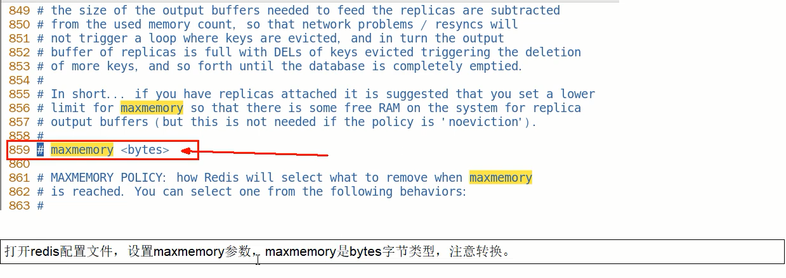
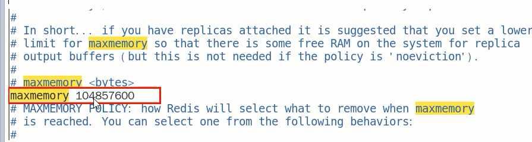

#### 面试题

生产上你们redis 内存设置是多少

如何配置、修改redis 的内存大小

如果内存满了怎么办

redis清理内存的方式？定期清除和惰性删除有了解吗

redis 缓存淘汰策略

redis 的LRU了解过吗？可否手写一个LRU算法


#### Redis内存满了怎么办？

##### redis默认内存多少？在哪查？如何修改？

Q：查看 Redis 最大占用内存？

A：

Q：redis 默认内存是多少？

A：如果不设置内存大小或者设置内存大小为0，在64位操作系统下不限制内存大小，在32位操作系统下最多使用3GB的内存

Q：一般生产上你如何配置？

A：一般推荐Redis 设置内存为最大物理内存的四分之三

Q：如何修改 redis 内存设置？

A：通过修改文件配置

```
例如设置为100M
maxmemory  104857600
```



通过命令修改

```
设置redis内存大小
config set maxmemory 1024
 
查看当前redis内存大小
config get maxmemory
```

Q：什么命令查看 redis 内存使用情况

A：info memory

Q：真要打满了会怎么样？如果redis 内存使用超出了设置的最大值会怎么样？

A：可以在本机试验一下，实质 redis 内存最大值为 1byte，超过实质的内存大小之后，redis 同样会报 OOM


结论：

设置了maxmemory的选项，假如redis 内存使用达到了上限，并且没有加上过期时间，这样也会导致数据写满 maxmemory，为避免类似情况，引出下面的内存淘汰策略


