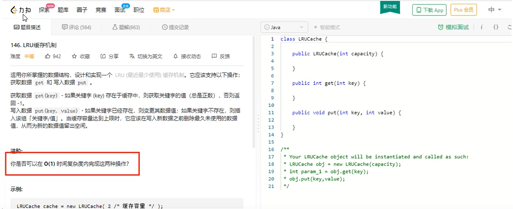

### redis 的 LRU 算法简介

#### redis 的 LRU 了解过吗？可否手写一个LRU算法？ LRU是什么？

LRU是 Least Recently used 的缩写，即最近最少使用，是一种常用的页面置换算法，选择最近最久未使用的数据予以淘汰

#### 算法来源(https://leetcode-cn.com/problems/lru-cache/)



#### 设计思想

1.所谓缓存，必须 要有读+写两个操作，按照命中率的思路考虑，写操作+读操作时间复杂度都需要为O(1)

2.特殊要求

2.1必须要有顺序之分，区分最近使用和很久没有使用的数据排序

2.2写和读操作一次搞定

2.3 如果容量（坑位）满了要删除最不常用的数据，每次新访问还要把新的数据插入到队头（按照业务自己设定左右那一边是队头）

**查找快，插入块，删除快，且还需要先后排序  -------> 什么样的数据结构可以满足这个问题？**

LRU的算法核心是哈希链表，本质就是HashMap + DoubleLinkedList 时间复杂度是O(1)，哈希表 + 双向链表的结合体


编码手写如何实现LRU

案例一：参考LinkedHashMap

```java
package com.romanticlei.LRUCacheDemo;

import java.util.LinkedHashMap;
import java.util.Map;

public class LRUCacheDemo<K, V> extends LinkedHashMap<K, V> {

    private int capacity; // 缓存坑位

    public LRUCacheDemo(int capacity) {
        // super(capacity, 0.75F, true);
        super(capacity, 0.75F, false);
        this.capacity = capacity;
    }

    @Override
    protected boolean removeEldestEntry(Map.Entry<K, V> eldest) {
        return super.size() > capacity;
    }

    public static void main(String[] args) {
        LRUCacheDemo lruCacheDemo = new LRUCacheDemo(3);

        lruCacheDemo.put(1, "a");
        lruCacheDemo.put(2, "b");
        lruCacheDemo.put(3, "c");
        System.out.println(lruCacheDemo.keySet());

        /**
         * super(capacity, 0.75F, true); --> 最近最少使用先出
         * [1, 2, 3]
         * [2, 3, 5]
         * [2, 5, 3]
         * [2, 5, 3]
         * [2, 5, 3]
         * [5, 3, 6]
         *
         * super(capacity, 0.75F, false); --> 先进先出
         * [1, 2, 3]
         * [2, 3, 5]
         * [2, 3, 5]
         * [2, 3, 5]
         * [2, 3, 5]
         * [3, 5, 6]
         *
         */
        lruCacheDemo.put(5, "f");
        System.out.println(lruCacheDemo.keySet());
        lruCacheDemo.put(3, "c");
        System.out.println(lruCacheDemo.keySet());
        lruCacheDemo.put(3, "c");
        System.out.println(lruCacheDemo.keySet());
        lruCacheDemo.put(3, "c");
        System.out.println(lruCacheDemo.keySet());
        lruCacheDemo.put(6, "g");
        System.out.println(lruCacheDemo.keySet());
    
    }
}
```


案例02：不依赖JDK，手写

```java
package com.romanticlei.LRUCacheDemo;

import java.util.Collection;
import java.util.HashMap;
import java.util.Map;

public class LRUCacheDemo1 {

    /**
     * 思路：
     * map 负责查找，构建一个虚拟的双向链表，它里面安装的就是一个个Node节点，作为数据载体
     * @param <K,  V>
     */

    // 1.构建一个Node节点，作为数据载体
    class Node<K,  V>{
        K key;
        V value;
        Node<K, V> prev;
        Node<K, V> next;

        public Node() {
            this.prev = this.next = null;
        }

        public Node(K key, V value) {
            this.key = key;
            this.value = value;
            this.prev = this.next = null;
        }
    }

    // 2.构造一个虚拟的双向队列，里面安放的就是我们的Node
    class DoubleLinkedList<K, V>{
        Node<K, V> head;
        Node<K, V> tail;

        // 2.1 构造方法
        public DoubleLinkedList() {
            head = new Node<>();
            tail = new Node<>();
            head.next = tail;
            tail.next = head;
        }

        // 2.2 添加到头
        public void addHead(Node<K, V> node){
            node.next = head.next;
            node.prev = head;
            head.next.prev = node;
            head.next = node;
        }

        // 2.3 删除节点
        public void removeNode(Node<K, V> node){
            // head.next.prev = node.prev;
            // head.next = node.next;
            // node.prev = null;
            // node.next = null;

            // tail.prev = node.prev;
            // node.prev.next = tail;
            // node.prev = null;
            // node.next = null;

            node.prev.next = node.next;
            node.next.prev = node.prev;
            node.next = null;
            node.prev = null;
        }

        // 2.4 获得最后一个结点
        public Node getLast(){
            return tail.prev;
        }
    }

    private int cacheSize;
    Map<Integer, Node<Integer, Integer>> map;
    DoubleLinkedList<Integer, Integer> doubleLinkedList;

    public LRUCacheDemo1(int cacheSize) {
        this.cacheSize = cacheSize; // 坑位
        map = new HashMap<>(); // 查找
        doubleLinkedList = new DoubleLinkedList<>();
    }

    public int get(int key){
        // 获取不到对应的key，返回-1
        if (!map.containsKey(key)){
            return -1;
        }

        // 获取到对应节点之后，删除节点，然后添加到队头，最近最多使用的位置
        Node<Integer, Integer> node = map.get(key);
        doubleLinkedList.removeNode(node);
        doubleLinkedList.addHead(node);

        return node.value;
    }

    public void put(int key, int value){
        // 表中存在此key，先删除，后添加到队头
        if (map.containsKey(key)){
            Node<Integer, Integer> node = map.get(key);
            node.value = value;
            map.put(key, node);

            doubleLinkedList.removeNode(node);
            doubleLinkedList.addHead(node);
        }else {
            // 没有找到就去添加，添加新元素时需要判断是否超过坑位大小
            if (map.size() >= cacheSize){
                Node<Integer, Integer> lastNode = doubleLinkedList.getLast();
                map.remove(lastNode.key);
                doubleLinkedList.removeNode(lastNode);
            }

            // 将新节点新增进来
            Node<Integer, Integer> newNode = new Node<>(key, value);
            map.put(key, newNode);
            doubleLinkedList.addHead(newNode);
        }
    }

    // 2.构造一个双向队列，里面安放的就是我们的Node
    public static void main(String[] args) {
        LRUCacheDemo1 lruCacheDemo = new LRUCacheDemo1(3);

        lruCacheDemo.put(1, 1);
        lruCacheDemo.put(2, 2);
        lruCacheDemo.put(3, 3);
        System.out.println(lruCacheDemo.map.keySet());

        lruCacheDemo.put(5, 5);
        System.out.println(lruCacheDemo.map.keySet());
        lruCacheDemo.put(6, 6);
        System.out.println(lruCacheDemo.map.keySet());
        lruCacheDemo.put(3, 3);
        System.out.println(lruCacheDemo.map.keySet());
        lruCacheDemo.put(3, 3);
        System.out.println(lruCacheDemo.map.keySet());
        lruCacheDemo.put(31, 31);
        System.out.println(lruCacheDemo.map.keySet());

        for (Node<Integer, Integer> node : lruCacheDemo.map.values()){
            System.out.println(node.value);
        }
    }
}
```


